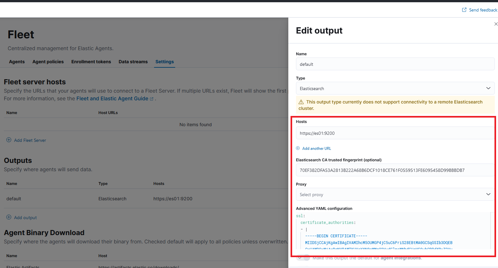

This project demonstrates how to set up a user for each ELK service and store user credentials in keystores.

Brief video explanation: https://github.com/evermight/elk-docker-compose-keystore

Full video explanation: TBD

# GET STARTED

1. Type `docker-compose up --build -d`.
2. Go to kibana at `https://<ip address of server>:5601`
3. Login with `elastic` and the password found in the `.env` file.
4. Go to Fleet > Settings.
5. Run the `./get-cert-details.sh` to determine your CA finger print and your CA.
6. Populate the information as shown in this screenshot: 
7. Press save.
8. Ensure everything is operational: metricbeat, filebeat, logstash, APM.

## Optional Steps

You can now remove any secrets from your `.env` file and also change the password for the `elastic` user.

1. Go to your `.env` file and replace `ELASTIC_PASSWORD, APM_PASS, ENCRYPTION_KEY` with fake data.  Do NOT delete these variables because I haven't done enough "null" and "empty" checks in my bash scripts.  The more important point is that these variables are no longer used.
2. Go to your `docker-compose.yml` file and delete the line `ELASTICSEARCH_PASSWORD` from the environment of the `es01` container.  It's not used any more.
3. Go to your `docker-compose.yml` file and delete the lines `KIBANA_*` from the environment of the `fleet-server` container.  It's not used any more.
4. Go to Kibana Stack Management > Users and change the password for the `elastic` user so that no one can use it again.
You can change the password for `elastic` under Stack Management.
